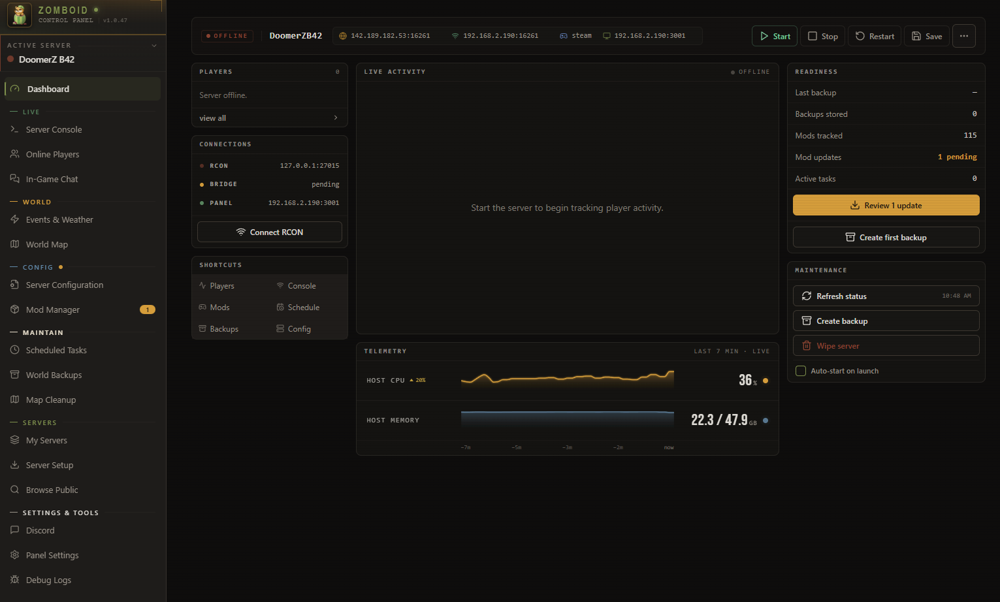
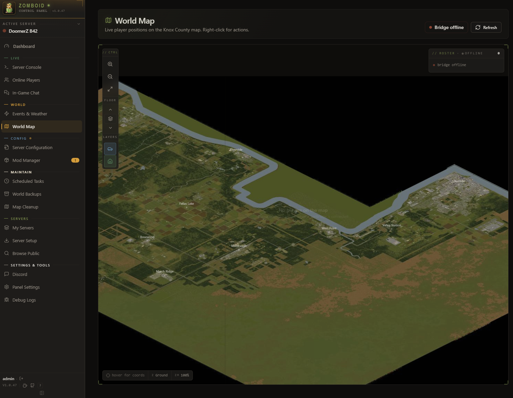
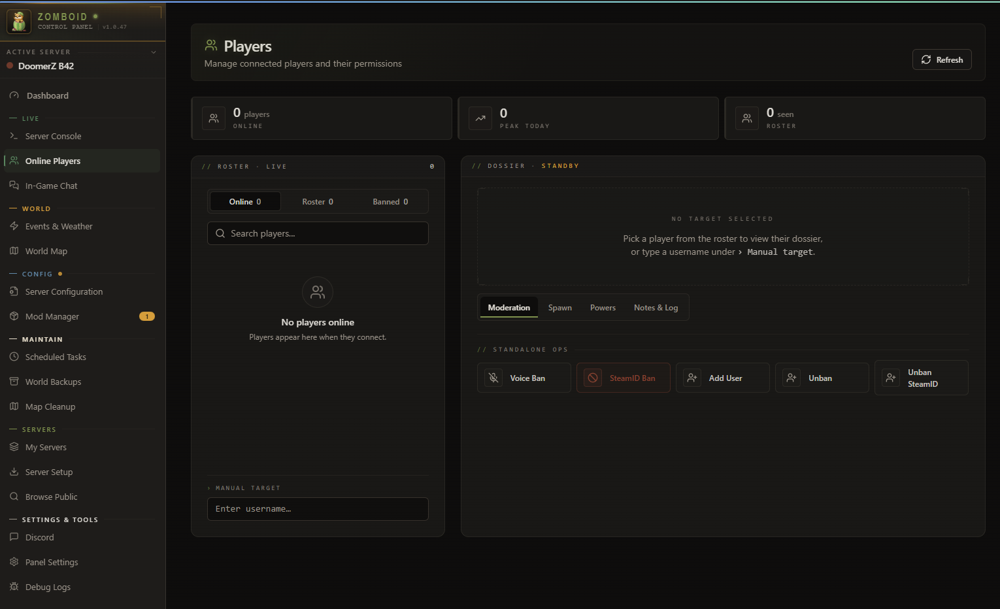
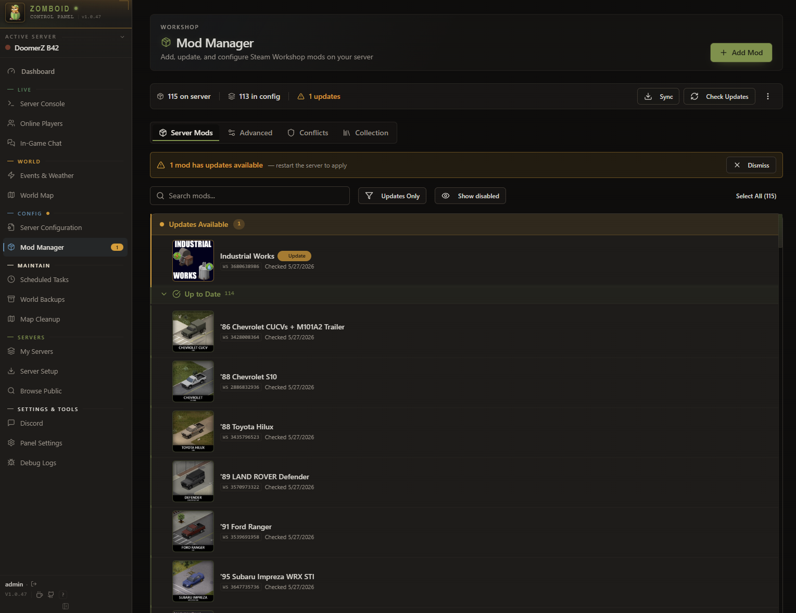
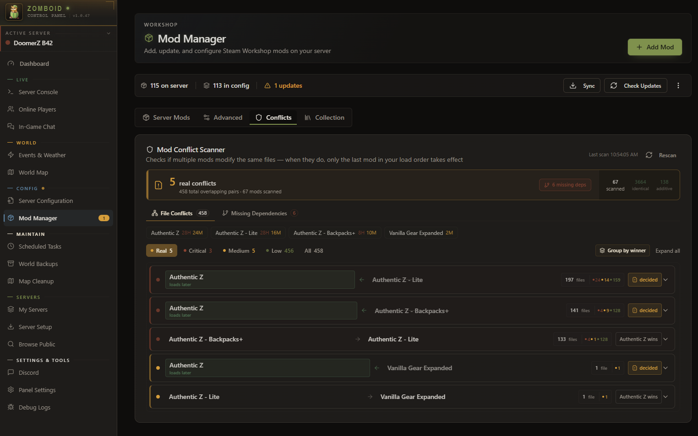
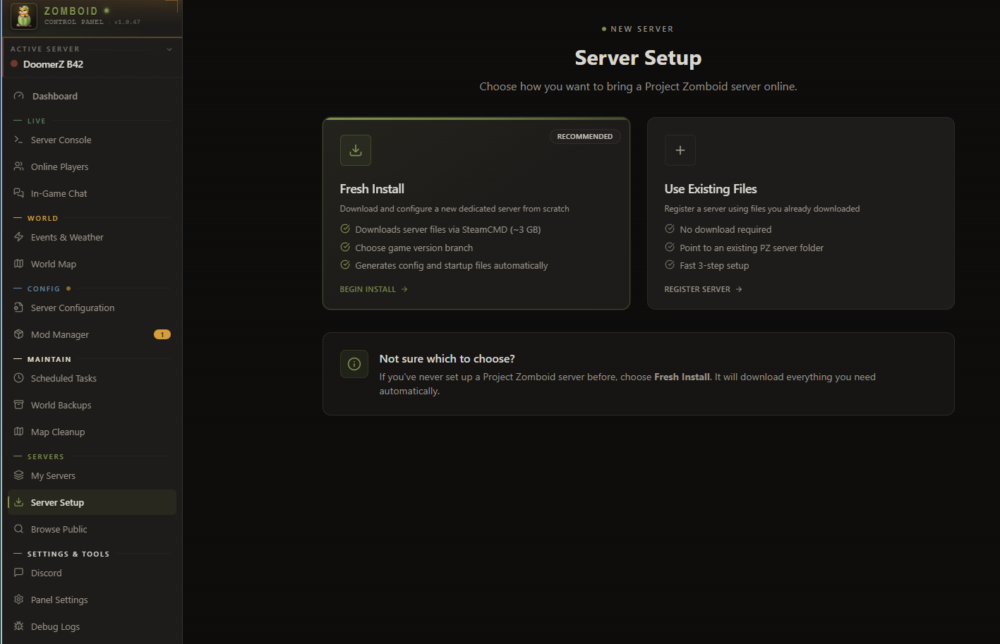
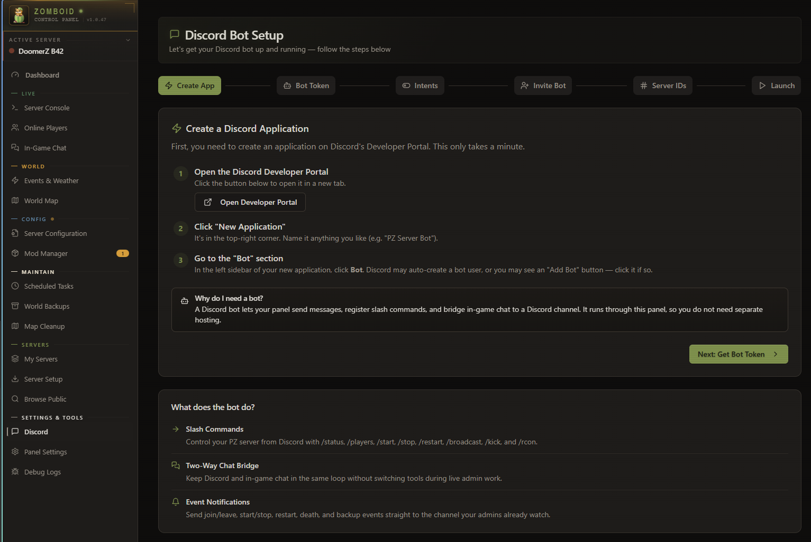
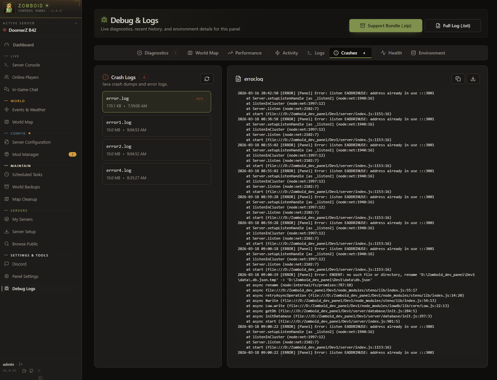

<div align="center">

# 🧟 Better Zomboid Control Panel

### The complete admin cockpit for Project Zomboid dedicated servers

[](https://github.com/itsmeares/better-zcp/releases/latest)
[](https://github.com/itsmeares/better-zcp/releases)
[](https://discord.gg/jHsWJDNmSg)
[](LICENSE)

Project Zomboid is a zombie survival game; playing it with friends means running a **dedicated server** somewhere. Zomboid Control Panel is the web app that sets up and manages that server for you — no command line required — with a live world map, Workshop mod management, scheduled restarts, backups, and Discord integration built in.

[**🚀 Download**](https://github.com/itsmeares/better-zcp/releases/latest) ·
[**👁️ Live demo**](https://itsmeares.github.io/better-zcp/) ·
[**💬 Discord**](https://discord.gg/jHsWJDNmSg) ·
[**📖 Setup**](#quick-start)

</div>

<br />



> **At a glance** — server status, RCON & PanelBridge connection state, live player activity, host telemetry, disk headroom, the next scheduled maintenance action, console error count, backup readiness, and quick actions. One screen covers 80% of routine admin work.

## ✨ Feature tour

<table>
<tr>
<td width="50%" valign="top">

### 🌧️ Events & Weather
Force-trigger blizzards, tropical storms, or rain at any intensity. Fine-grained climate sliders for fog, wind, temperature, clouds, humidity. Spawn helicopter events or lightning strikes on demand. The closest thing to PZ admin god-mode.


</td>
<td width="50%" valign="top">

### 🗺️ Live World Map
Real-time player positions on Knox County. Multi-floor support, layer toggles, zoom & pan. Right-click any player for instant teleport, heal, kick, or message — straight from the map. Map tiles are proxied and cached by the panel itself, which also auto-detects the current PZ map build so a new release doesn't leave you looking at a stale layout.



</td>
</tr>
<tr>
<td width="50%" valign="top">

### 👥 Player Management
Roster with online / offline / banned tabs. Per-player dossier with moderation, spawn loadout, powers (heal, teleport, god mode), notes & history. Voice ban, SteamID ban, manual targeting.



</td>
<td width="50%" valign="top">

### 🧩 Mod Manager
Tracks every Workshop mod on your server and flags updates through the Steam API. Import a Steam collection and drive server membership from it — adding a mod writes `WorkshopItems=`, resolves its internal mod ID into `Mods=`, and picks up map folders on its own.



</td>
</tr>
<tr>
<td width="50%" valign="top">

### ⚠️ Mod Conflicts & Load Order
Scans your mod list for known incompatibilities, missing dependencies, and load-order issues. Severity-tinted findings so you see real problems before you boot the server. Load order can auto-sort from each mod's declared `require=`, with a preview of every move before anything is written.



</td>
<td width="50%" valign="top">

### ⚙️ Server Configuration
Full in-browser INI editor for sandbox options, spawn regions, mod settings, and server flags. Searchable, structured view + raw view for power users. No more notepad-and-restart. Mod Settings edits apply live through PanelBridge while the server is running, and now save to disk correctly too — no need to stop the server just to make an edit stick.


</td>
</tr>
<tr>
<td width="50%" valign="top">

### 🆕 Server Setup Wizard
Spin up a fresh PZ server in minutes. SteamCMD install, port config, RCON setup, admin account — all stepped through with sensible defaults.



</td>
<td width="50%" valign="top">

### 🤖 Discord Bot Setup
Guided wizard for creating the Discord app, getting tokens, and inviting the bot. Slash commands + two-way chat relay + event notifications ship turnkey.

**The step that trips people up:** in the Discord Developer Portal, under your application's **Bot** page, turn on the **Server Members** and **Message Content** privileged intents. Both are off by default and have nothing to do with your token — a correct token and correct IDs will still fail to connect without them. Check both before you click Start; the panel names the exact problem if you hit it anyway, instead of a generic "check configuration."



</td>
</tr>
<tr>
<td width="50%" valign="top">

### 📊 Performance Telemetry
Host RAM and CPU graphs, PZ process memory, player count history. Time-range selectable, exportable. Catch slow leaks and load spikes before players notice.


</td>
<td width="50%" valign="top">

### 🐛 Crash Logs & Diagnostics
Java crash dumps, error logs, support bundles. One-click `.zip` export for when you need to share state with someone smarter than you. Health, environment, and activity tabs included, plus a Diagnostics tab that runs dozens of checks across the panel, the server, and PanelBridge — some fail with a one-click fix, others link straight to the setting that needs attention.



</td>
</tr>
<tr>
<td width="50%" valign="top">

### 💾 Backups
Manual or scheduled world backups with configurable retention. Preview a snapshot's contents before you restore it, download the raw archive, or upload an external one back in. Restoring stops the server, takes an automatic safety backup of the current state first, then rolls the world back — with an explicit warning that it can't be undone.

</td>
<td width="50%" valign="top">

### 🧹 Chunk Cleaner & Map Cleanup
Visual map selector for reclaiming disk space from an aging save. Delete individual chunks or drag out a rectangular region, with per-save stats so you know what you're removing before you commit. Panning, selecting, and computing those stats all got noticeably faster on large saves.

</td>
</tr>
</table>

---

## Contents

- [What It Does](#what-it-does)
- [Requirements](#requirements)
- [Quick Start](#quick-start)
- [Setup](#setup)
- [PanelBridge](#panelbridge-optional)
- [Remote Access](#remote-access)
- [Security](#security)
- [Development](#development)
- [Community](#community)

---

## What It Does

### Operate
- **Server control** — Start, stop, restart, save. Live status and uptime.
- **Console** — Live log viewer and RCON terminal with command history.
- **Scheduling** — Recurring restarts, saves, broadcasts with countdown warnings.
- **Backups** — Manual or scheduled world backups with configurable retention, snapshot preview, and download/upload of the raw archive. Restore takes an automatic safety backup first and warns it can't be undone.
- **Roles & permissions** — Capability-based access control: three built-in roles (admin, technician, moderator) plus fully custom ones, each granting an explicit subset of the panel's 28 individual capabilities across 12 areas (server lifecycle, RCON, backups, mods, and more).
- **Account recovery** — Single-use recovery codes, generated in advance from an authenticated admin session, let the admin reset their own password later if they get locked out. Two more paths cover losing access to the panel entirely: a local-only token file, or the `--reset-password` CLI flag run directly on the server.

### Observe
- **Players** — Online list, activity history, kick/ban/unban, access levels, notes and tags.
- **World map** — Live player positions on Knox County with right-click actions.
- **Mod manager** — Track Workshop mods and detect updates, decide server membership from your Steam collection, auto-sort load order by declared dependencies, and scan for conflicts. Collection sync adds what's missing without deleting the optional mods you keep on the side.
- **Server config** — Full INI editor with structured and raw views. Sandbox, spawn points, mod settings — searchable and editable in-browser.

### Extend
- **Events & weather** — Rain, storms, blizzards, climate control, time control, sound triggers, zombie management.
- **PanelBridge** — Server-side Lua mod for actions RCON can't reach: teleport, heal, god mode, character export/import, inventory.
- **Discord bot** — Slash commands and two-way chat relay.
- **Single sign-on (SSO)** — OpenID Connect login, with ready-made presets for Google, Authentik, Keycloak, Azure AD, Okta, and Auth0, or any other compliant provider entered by hand. Full discovery + PKCE + state/nonce flow, with a one-click credential test before you commit to it.
- **Multi-server** — Manage multiple PZ servers from one panel.
- **Chunk cleaner** — Visual map selector for reclaiming disk space from an aging save: delete individual chunks or drag out a rectangular region, with per-save stats before you commit.
- **Auto-update** — Checks for new releases, downloads and applies them.

---

## Requirements

**Don't have a Project Zomboid server yet?** You don't need one before you start — the Setup Wizard in Quick Start below installs a fresh Build 41 or Build 42 server for you, RCON included. The rest of this section applies either way; if you're pointing the panel at a server you already run, confirm these in its `.ini` first:

- **RCON enabled**, and **network access** between the panel and the PZ server (same machine, same LAN, or a reachable IP):
  ```ini
  RCONPort=27015
  RCONPassword=choose-a-strong-password
  DoLuaChecksum=false
  ```
  Use the actual RCON port and password configured for your server. `DoLuaChecksum=false` is needed only for PanelBridge features.
- **`curl`** for World Map build detection (Docker, Windows, and macOS already have it; a bare-metal Linux tarball install might not). Without it, the map still works — it just falls back to a fixed build and stops tracking new Project Zomboid map releases, which Debug > World Map will flag.

The packaged binary includes its own runtime — no Node.js, Python, or Java install needed on the panel host.

---

## Quick Start

Choose where the **panel** runs. It can run beside the game server, in Docker,
or on a separate computer. The panel needs RCON access to the game server;
PanelBridge features additionally need its server files or SFTP access.

| Your setup | Use this guide |
| --- | --- |
| Windows PC or Windows server | [docs/install/windows.md](docs/install/windows.md) |
| Linux PC, VPS, or home server | [docs/install/linux.md](docs/install/linux.md) |
| macOS | [macOS](#macos) below |
| Docker or Unraid | [docs/install/docker.md](docs/install/docker.md) |
| Renting from a host (Indifferent Broccoli, etc.) | [docs/install/hosted.md](docs/install/hosted.md) |

**Not sure which?** If you already rent a Project Zomboid server from a host, pick Hosted — you're not installing anything server-side. Otherwise pick the row that matches the computer the *panel* will run on; Docker needs the fewest manual steps if that machine has it.

Every path above ends the same way: a browser tab open to the panel's setup screen, where you create your admin account. Download the current package from [Releases](https://github.com/itsmeares/better-zcp/releases/latest). Something not working? [docs/install/troubleshooting.md](docs/install/troubleshooting.md) is organized by what's actually on your screen, not by which guide you followed.

### macOS

There's no native macOS binary. Run the panel with Docker Desktop or OrbStack — see the macOS row in [docs/install/docker.md](docs/install/docker.md)'s own chooser table, which points you at the fastest of its four Docker paths. Project Zomboid server hosting itself needs Linux or a hosting provider; the panel can still run on your Mac.

### Docker and Unraid

The fastest path to a fully working setup — panel **and** a new Project
Zomboid server — is the all-in-one installer:

```bash
curl -fsSL https://raw.githubusercontent.com/itsmeares/better-zcp/main/infra/docker/all-in-one/bootstrap.sh | sh
```

It checks Docker, generates the secret and persistent configuration, pulls the
prebuilt release images, installs PZ, detects the LAN address, and publishes
the required UDP ports `16261` and `16262`, and prints the panel URL near the end
once the health check passes.

If PZ already runs on the host, in another container, or on another machine,
use the panel-only image instead:

```bash
curl -O https://raw.githubusercontent.com/itsmeares/better-zcp/main/docker-compose.install.yml
docker compose -f docker-compose.install.yml up -d
```

The panel-only image deliberately does not publish PZ game ports; those belong
to the existing game-server host or container.

See [docs/install/docker.md](docs/install/docker.md) for the full walkthrough
of these and the other two configurations (bind-mounting an existing PZ
install, and Unraid specifically) — including running PZ in a separate
container from the panel, and choosing between the published image and
building from source.

---

## Setup

1. Open the panel and create your admin account.
2. In **Settings**, set your server install path and Zomboid data path.
3. Configure RCON (host, port `27015`, password from your server `.ini`).
4. Optionally install PanelBridge for advanced features.

If you installed a brand-new server with the Setup Wizard, steps 2 and 3 are already done — the wizard fills them in as part of installing.

### PanelBridge (Optional)

PanelBridge is a server-side Lua drop-in that enables features RCON can't reach — teleport, heal, weather control, character export/import, inventory editing, sound triggers.

There is no client-side component. Players don't install anything. The panel copies `PanelBridge.lua` into your server's `Install/media/lua/server/` folder, then you set `DoLuaChecksum=false` in the server INI, restart the PZ server, and enable it in **Settings → PanelBridge**.

For a remote server without a shared filesystem, use the **Remote server via
SFTP** option in the same panel. It syncs the bridge command and result files
through a local cache; it does not expose the server's full filesystem to the
panel.

---

## Remote Access

If you're running the panel on the same machine as your browser, skip this section.

To access the panel from another machine, allow the origin before first launch:

```bash
CORS_ORIGINS=http://YOUR-IP:3001 ./start.sh
```

After login, save it permanently in **Settings → Remote Access** so the env var isn't required next time.

For VPS or public-internet deployment, put the panel behind a reverse proxy (nginx or Caddy) with HTTPS, and set `HTTPS=true` so the panel emits HSTS headers. Don't expose port 3001 directly to the internet.

### nginx reverse proxy

The panel uses a live socket.io connection for status updates, chat, and the world map's activity overlay — nginx does not forward WebSocket upgrade requests by default, so without the `Upgrade`/`Connection` headers below the panel will load but the connection indicator will show disconnected and any live-updating panel (world map included) will silently stop working, while everything else keeps working normally. This is the single most common reverse-proxy misconfiguration reported against the panel.

Recommended pattern: terminate TLS at nginx, run the panel itself over plain HTTP behind it (no need to also configure certificates inside the panel).

```nginx
server {
    listen 443 ssl http2;
    server_name your-domain.example.com;

    ssl_certificate     /path/to/fullchain.pem;
    ssl_certificate_key /path/to/privkey.pem;

    location / {
        proxy_pass http://127.0.0.1:3001;
        proxy_http_version 1.1;

        # Required for socket.io — without these two lines the panel's
        # live connection never establishes, but every plain HTTP(S)
        # request still works, which is why this is easy to miss.
        proxy_set_header Upgrade $http_upgrade;
        proxy_set_header Connection "upgrade";

        proxy_set_header Host $host;
        proxy_set_header X-Real-IP $remote_addr;
        proxy_set_header X-Forwarded-For $proxy_add_x_forwarded_for;
        proxy_set_header X-Forwarded-Proto $scheme;
    }
}
```

Then set these before first launch (see [linux.md Phase 10](docs/install/linux.md) for the systemd equivalent):

```bash
TRUST_PROXY=1 HTTPS=true ./start.sh
```

`TRUST_PROXY=1` tells the panel to trust the `X-Forwarded-*` headers above for one proxy hop (IP-based rate limiting and login all key off this) — only set it if the panel is genuinely reachable exclusively through your proxy, never if port 3001 is also exposed directly. `HTTPS=true` makes the panel emit HSTS and treat the connection as secure for cookies even though it's speaking plain HTTP to nginx.

If you instead terminate TLS at nginx *and* run the panel's own HTTPS listener behind it (double TLS termination — only needed if something else on the same host also talks to the panel directly over HTTPS), point `proxy_pass` at `https://127.0.0.1:<your HTTPS port>` instead and add `proxy_ssl_verify off;` if you're using the panel's self-signed certificate. The `Upgrade`/`Connection` headers above are still required either way — they're about forwarding the client's upgrade request, not about which protocol nginx uses to reach the panel.

---

## Security

- JWT authentication on all API routes.
- Capability-based roles: three built-in roles plus custom ones, each granting only the specific actions it needs — a moderator account doesn't get server-wipe just because an admin's does.
- Rate limiting on login, RCON, and destructive operations.
- RCON parameter sanitization to prevent command injection.
- CORS configurable per deployment (LAN auto-allows private IPs, VPS requires explicit origins).
- Recovery codes are single-use, enforced even against two redemption attempts racing each other.
- Password reset via secure token file or `--reset-password` CLI flag.

---

## Development

```bash
corepack enable
corepack install
pnpm install
pnpm dev
```
Frontend at `http://localhost:5173`, backend at `http://localhost:3001`.

```bash
pnpm run build:exe:all     # Build Windows + Linux binaries
pnpm test                  # Run tests
```

---

## Community

- **Discord** — [discord.gg/jHsWJDNmSg](https://discord.gg/jHsWJDNmSg) for questions, support, and feature ideas.
- **Discussions** — [Ask questions and share ideas](https://github.com/itsmeares/better-zcp/discussions).
- **Issues** — [Report bugs or request features](https://github.com/itsmeares/better-zcp/issues) on GitHub.
- **Contributing** — Read [.github/CONTRIBUTING.md](.github/CONTRIBUTING.md) before opening a pull request.
- **Security** — Follow [.github/SECURITY.md](.github/SECURITY.md) for private vulnerability reports.
- **Release notes** — See the [latest release notes](https://github.com/itsmeares/better-zcp/releases/latest) for what's new.

---

## License

This project is licensed under the [GNU Affero General Public License v3.0
only](LICENSE). Upstream MIT material is documented in [NOTICE.md](NOTICE.md).
