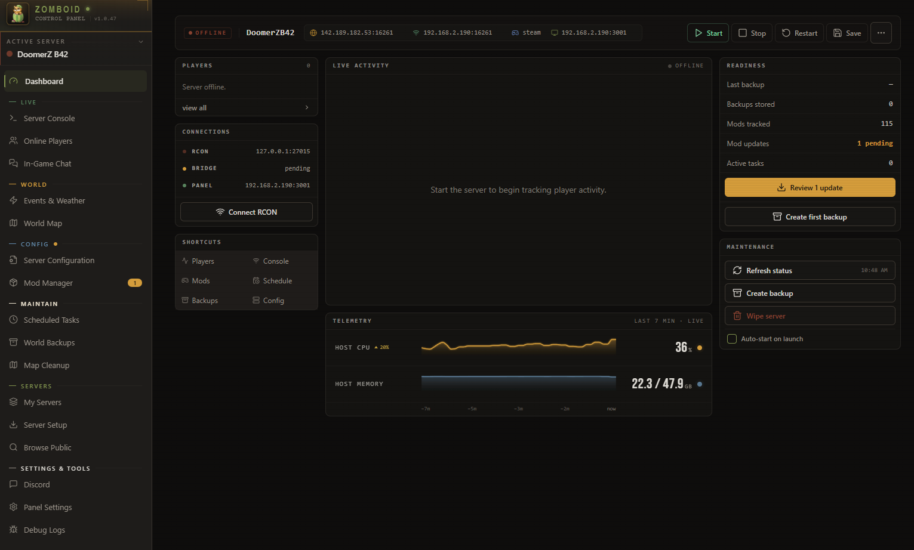
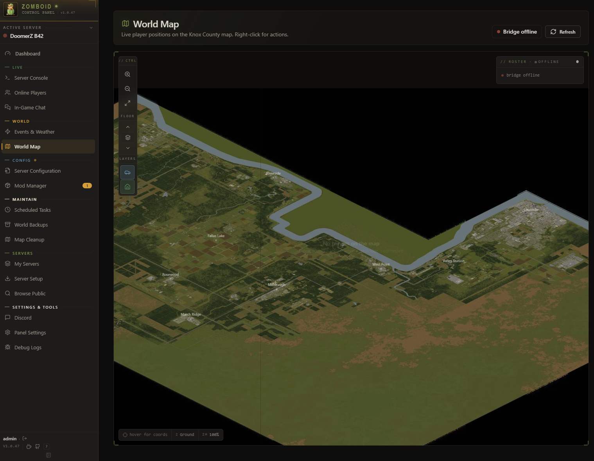
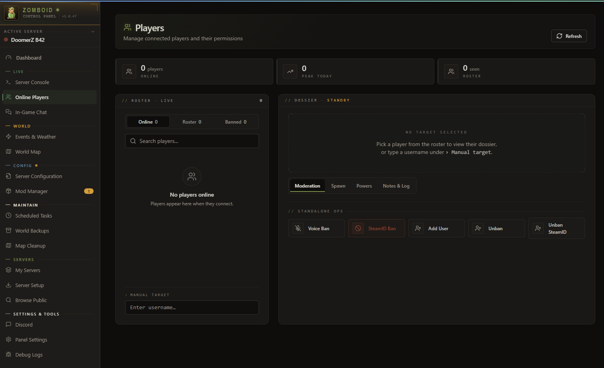
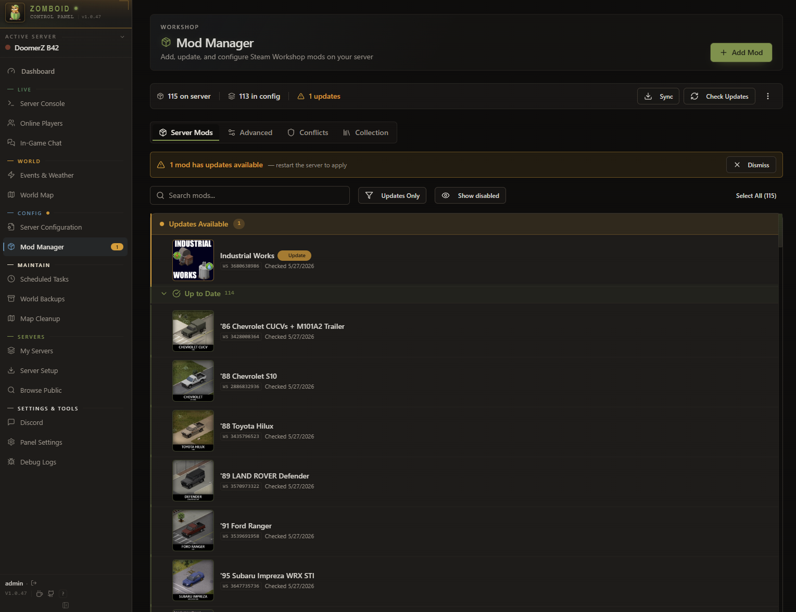
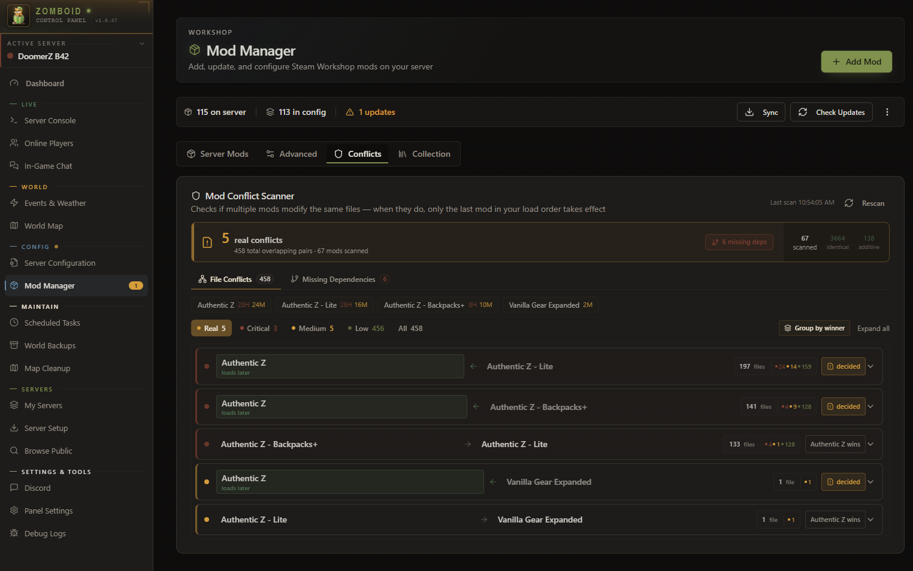
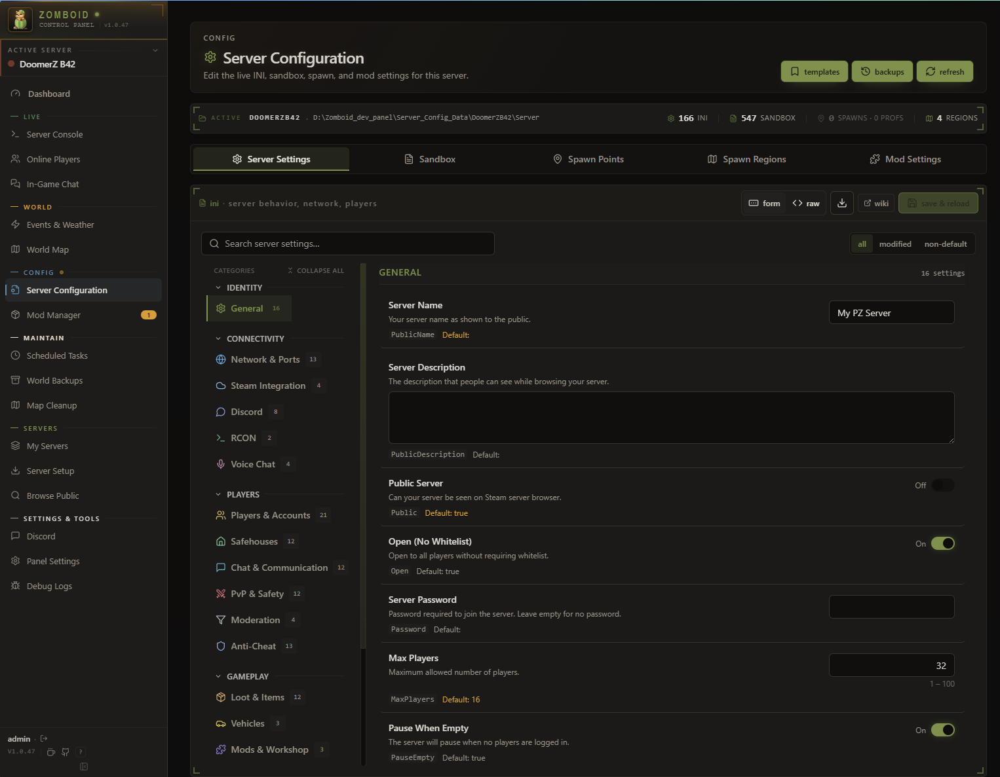
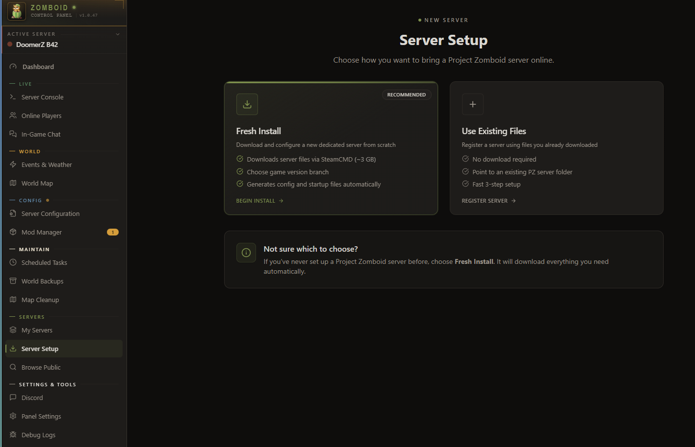
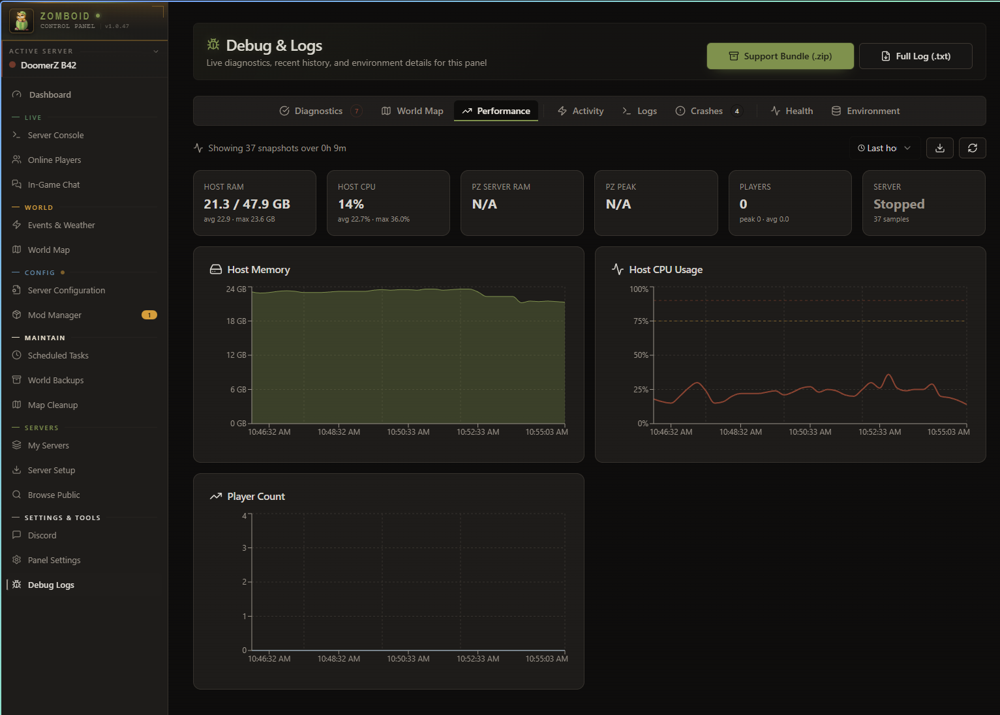
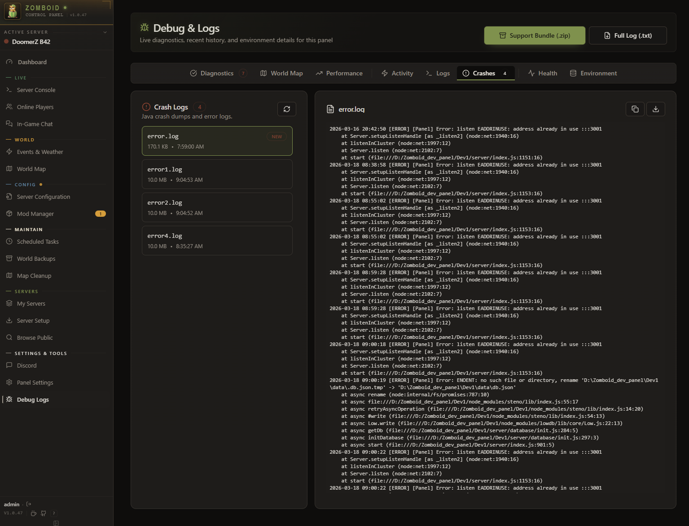

<div align="center">

# 🧟 Better Zomboid Control Panel

### The complete admin cockpit for Project Zomboid dedicated servers

[](https://github.com/itsmeares/better-zcp/releases)
[](https://github.com/itsmeares/better-zcp/releases)
[](https://discord.gg/jHsWJDNmSg)
[](LICENSE)

Project Zomboid is a zombie survival game; playing it with friends means running a **dedicated server** somewhere. Zomboid Control Panel is the web app that sets up and manages that server for you — no command line required — with a live world map, Workshop mod management, scheduled restarts, and backups built in.

[**🚀 Download**](https://github.com/itsmeares/better-zcp/releases) ·
[**👁️ Live demo**](https://itsmeares.github.io/better-zcp/) ·
[**💬 Discord**](https://discord.gg/jHsWJDNmSg) ·
[**📖 Setup**](#quick-start)

</div>

<br />



> **At a glance** — server status, RCON and game integration state, live player activity, host telemetry, disk headroom, the next scheduled maintenance action, console error count, backup readiness, and quick actions. One screen covers 80% of routine admin work.

## ✨ Feature tour

<table>
<tr>
<td colspan="2" valign="top">

### 🗺️ Live World Map
Live player positions, every floor including basements, zombie density, coordinate teleport, and search for towns, streets, building types and rooms. The map is drawn from your server's own game files: the map image and building outlines, street names, town labels, and room layouts per floor. Mod maps in the server's `Map=` order are drawn with the same priority the game uses. Nothing is sent to an outside service.



</td>
</tr>
<tr>
<td width="50%" valign="top">

### 👥 Player Management
Roster with online / offline / banned tabs. Per-player details with moderation, item delivery, XP, invisibility, noclip, god mode, teleport, heal and kill, live status, recent sessions, and lifelong playtime and deaths. Voice ban, SteamID ban, manual targeting.



</td>
<td width="50%" valign="top">

### 🧩 Mod Manager
Tracks every Workshop mod on your server and flags updates through the Steam API. Import a Steam collection and drive server membership from it — adding a mod writes `WorkshopItems=`, resolves its internal mod ID into `Mods=`, and picks up map folders on its own.



</td>
</tr>
<tr>
<td width="50%" valign="top">

### ⚠️ Mod Conflicts & Load Order
Scans your mod list for known incompatibilities, missing dependencies, and load-order issues. Severity-tinted findings so you see real problems before you boot the server. Load order can auto-sort from each mod's declared `require=`, with a preview of every move before anything is written.



</td>
<td width="50%" valign="top">

### ⚙️ Server Configuration
Full in-browser INI editor for sandbox options, spawn regions, mod settings, and server flags. Searchable, structured view + raw view for power users. No more notepad-and-restart. Mod settings edits apply live through game integration while the server is running and save to disk.



</td>
</tr>
<tr>
<td width="50%" valign="top">

### 🆕 Server Setup Wizard
Spin up a fresh PZ server in minutes. SteamCMD install, port config, RCON setup, admin account — all stepped through with sensible defaults.



</td>
</tr>
<tr>
<td width="50%" valign="top">

### 📊 Performance Telemetry
Host RAM and CPU graphs, PZ process memory, player count history. The last 24 hours remain available for inspection. Catch slow leaks and load spikes before players notice.



</td>
<td width="50%" valign="top">

### 🐛 Crash Logs & Diagnostics
Text crash and error logs with full-file downloads, plus a support bundle containing logs and diagnostics. The bundle masks known secrets and excludes saves, full databases and binary crash dumps. Health, environment and activity tabs include panel, game server and map-provider status.



</td>
</tr>
<tr>
<td colspan="2" valign="top">

### 💾 Backups
Manual or scheduled world backups with configurable retention. Preview a snapshot's contents before you restore it, download the raw archive, or upload an external one back in. Restoring stops the server, takes an automatic safety backup of the current state first, then rolls the world back — with an explicit warning that it can't be undone.

</td>

</tr>
</table>

---

## Contents

- [What It Does](#what-it-does)
- [Requirements](#requirements)
- [Quick Start](#quick-start)
- [Setup](#setup)
- [Game Integration](#game-integration-optional)
- [Remote Access](#remote-access)
- [Security](#security)
- [Development](#development)
- [Community](#community)

---

## What It Does

### Operate
- **Server control** — Start, stop, restart, save. Live status and uptime.
- **Console** — Live log viewer and RCON terminal with command history.
- **Scheduling** — Recurring restarts, saves, broadcasts with countdown warnings.
- **Backups** — Manual or scheduled world backups with configurable retention, snapshot preview, and download/upload of the raw archive. Restore takes an automatic safety backup first and warns it can't be undone.
- **Account recovery** — Reset the admin password with a local-only token file or the `--reset-password` CLI flag run directly on the server.

### Observe
- **Players** — Online list, activity history, kick/ban/unban, access levels, recent sessions, and lifelong playtime and deaths.
- **World map** — Live player positions on Knox County with right-click actions.
- **Mod manager** — Track Workshop mods and detect updates, decide server membership from your Steam collection, auto-sort load order by declared dependencies, and scan for conflicts. Collection sync adds what's missing without deleting the optional mods you keep on the side.
- **Server config** — Full INI editor with structured and raw views. Sandbox, spawn points, mod settings — searchable and editable in-browser.

### Extend
- **Game integration** — Server-side Lua for live player positions and details, heal, kill, and live sandbox and mod settings. RCON handles moderation, player powers, teleport, item delivery, and XP.
- **Multi-server** — Manage multiple PZ servers from one panel.
- **Panel updates** — Checks for new releases. Native Windows/Linux packages update on request with a data backup and health-check rollback. Docker deployments show a host update command.

---

## Requirements

**Don't have a Project Zomboid server yet?** You don't need one before you start — the Setup Wizard in Quick Start below installs a fresh Build 42 server for you, RCON included. The rest of this section applies either way; if you're pointing the panel at a server you already run, confirm these in its `.ini` first:

- **RCON enabled**, and **network access** between the panel and the PZ server (same machine, same LAN, or a reachable IP):
  ```ini
  RCONPort=27015
  RCONPassword=choose-a-strong-password
  DoLuaChecksum=false
  ```
  Use the actual RCON port and password configured for your server. `DoLuaChecksum=false` is needed only for game integration features.

The packaged binary includes its own runtime — no Node.js, Python, or Java install needed on the panel host.

---

## Quick Start

The rebuilt panel is being tested as `v3.0.0-rc1`. Use the
[RC installation and test notes](docs/releases/3.0.0-rc1.md) for its exact
packages and Docker tags. The RC is a prerelease, and older panel databases
are not imported.

Choose where the **panel** runs. It can run beside the game server, in Docker,
or in a container with the game server's folders mounted. The panel needs
RCON access and local access to the server files it manages.

| Your setup                    | Use this guide                                     |
| ----------------------------- | -------------------------------------------------- |
| Windows PC or Windows server  | [docs/install/windows.md](docs/install/windows.md) |
| Linux PC, VPS, or home server | [docs/install/linux.md](docs/install/linux.md)     |
| macOS                         | [macOS](#macos) below                              |
| Docker or Unraid              | [docs/install/docker.md](docs/install/docker.md)   |

**Not sure which?** Pick the row that matches the computer the _panel_ will run on; Docker needs the fewest manual steps if that machine has it.

Every path above ends the same way: a browser tab open to the panel's setup screen, where you create your admin account. Download the current package from [Releases](https://github.com/itsmeares/better-zcp/releases). Something not working? [docs/install/troubleshooting.md](docs/install/troubleshooting.md) is organized by what's actually on your screen, not by which guide you followed.

### macOS

There's no native macOS binary. Run the panel with Docker Desktop or OrbStack
and connect it to a PZ server on Linux; see the macOS row in
[docs/install/docker.md](docs/install/docker.md). The managed stack installer
requires an amd64 Linux Docker host.

### Docker and Unraid

The fastest path to a fully working setup — panel **and** a new Project
Zomboid server — is the Docker stack installer:

```bash
curl -fsSL https://raw.githubusercontent.com/itsmeares/better-zcp/main/infra/docker/all-in-one/bootstrap.sh | sh
```

It checks Docker, creates persistent configuration, pulls the release image,
installs PZ, and starts the panel. Each server profile gets its own game
container when started. The panel can start and stop those containers; its
Docker socket mount grants it host-level Docker control.

If PZ already runs on the host, in another container, or on another machine,
use the panel-only image instead:

```bash
curl -O https://raw.githubusercontent.com/itsmeares/better-zcp/main/docker-compose.install.yml
docker compose -f docker-compose.install.yml up -d
```

The panel-only image deliberately does not publish PZ game ports; those belong
to the existing game-server host or container.

See [docs/install/docker.md](docs/install/docker.md) for the full walkthrough
of these and the other two configurations (bind-mounting an existing PZ
install, and Unraid specifically) — including running PZ in a separate
container from the panel, and choosing between the published image and
building from source.

---

## Setup

1. Open the panel and create your admin account.
2. In **Settings**, set your server install path and Zomboid data path.
3. Configure RCON (host, port `27015`, password from your server `.ini`).
4. Optionally install the game integration for live player details, heal/kill, and live mod settings.

If you installed a brand-new server with the Setup Wizard, steps 2 and 3 are already done — the wizard fills them in as part of installing.

### Database storage

Panel accounts, profiles, and history are stored in `data/panel.sqlite` using
Node's SQLite driver. Each server keeps its own configuration, schedules,
and history. Server selection is local to the browser URL.

This rebuild starts with a fresh panel database. Older `db.json` and
`db.sqlite` files stay on disk; they are not imported or deleted. Legacy database
import is not planned. Register existing servers again using their installation
and Zomboid data paths.
This does not reset their saves, game accounts, or configuration files.

### Game Integration (Optional)

Game integration adds live player positions and details, heal, kill, and live sandbox and mod settings. RCON handles player powers, moderation, teleport, item delivery, and XP.

The panel installs the server-side Lua integration before starting or restarting a configured server. If permissions prevent installation, open **Settings → Game integration** and use **Install** after correcting the server path.

---

## Remote Access

Local and LAN addresses work without a CORS setting. For a public DNS name or
reverse proxy, set the exact browser origin before first launch, including a
non-default port if used:

```bash
CORS_ORIGINS=https://panel.example.com ./start.sh
```

For Docker Compose, put `CORS_ORIGINS=https://panel.example.com` in the `.env`
file beside the compose file. After login, you can also save origins in
**Settings → Remote Access**.

For VPS or public-internet deployment, put the panel behind a reverse proxy (nginx or Caddy) with HTTPS, and set `HTTPS=true` so the panel emits HSTS headers. Don't expose port 3001 directly to the internet.

### nginx reverse proxy

The panel uses a live socket.io connection for status updates and the world map's activity overlay — nginx does not forward WebSocket upgrade requests by default, so without the `Upgrade`/`Connection` headers below the panel will load but the connection indicator will show disconnected and live updates will stop working.

Recommended pattern: terminate TLS at nginx, run the panel itself over plain HTTP behind it (no need to also configure certificates inside the panel).

```nginx
server {
    listen 443 ssl http2;
    server_name your-domain.example.com;

    ssl_certificate     /path/to/fullchain.pem;
    ssl_certificate_key /path/to/privkey.pem;

    location / {
        proxy_pass http://127.0.0.1:3001;
        proxy_http_version 1.1;

        # Required for socket.io — without these two lines the panel's
        # live connection never establishes, but every plain HTTP(S)
        # request still works, which is why this is easy to miss.
        proxy_set_header Upgrade $http_upgrade;
        proxy_set_header Connection "upgrade";

        proxy_set_header Host $host;
        proxy_set_header X-Real-IP $remote_addr;
        proxy_set_header X-Forwarded-For $proxy_add_x_forwarded_for;
        proxy_set_header X-Forwarded-Proto $scheme;
    }
}
```

Then set these before first launch (see [linux.md Phase 9](docs/install/linux.md) for the systemd equivalent):

```bash
TRUST_PROXY=1 HTTPS=true CORS_ORIGINS=https://your-domain.example.com ./start.sh
```

`TRUST_PROXY=1` tells the panel to trust the `X-Forwarded-*` headers above for one proxy hop (IP-based rate limiting and login all key off this) — only set it if the panel is genuinely reachable exclusively through your proxy, never if port 3001 is also exposed directly. `HTTPS=true` makes the panel emit HSTS and treat the connection as secure for cookies even though it's speaking plain HTTP to nginx.


---

## Security

- One local administrator account with JWT authentication on protected API routes.
- Rate limiting on login, RCON, and destructive operations.
- RCON parameter sanitization to prevent command injection.
- CORS configurable per deployment (LAN auto-allows private IPs, VPS requires explicit origins).
- Password reset via secure token file or `--reset-password` CLI flag.

---

## Development

```bash
corepack enable
corepack install
pnpm install
pnpm dev
```
Frontend at `http://localhost:5173`, backend at `http://localhost:3001`.

```bash
pnpm run build:exe:all     # Build Windows + Linux binaries
pnpm test                  # Run tests
```

---

## Community

- **Discord** — [discord.gg/jHsWJDNmSg](https://discord.gg/jHsWJDNmSg) for questions, support, and feature ideas.
- **Discussions** — [Ask questions and share ideas](https://github.com/itsmeares/better-zcp/discussions).
- **Issues** — [Report bugs or request features](https://github.com/itsmeares/better-zcp/issues) on GitHub.
- **Contributing** — Read [.github/CONTRIBUTING.md](.github/CONTRIBUTING.md) before opening a pull request.
- **Security** — Follow [.github/SECURITY.md](.github/SECURITY.md) for private vulnerability reports.
- **Release notes** — See the [latest release notes](https://github.com/itsmeares/better-zcp/releases) for what's new.

---

## License

This project is licensed under the [GNU Affero General Public License v3.0
only](LICENSE). Upstream MIT material is documented in [NOTICE.md](NOTICE.md).
